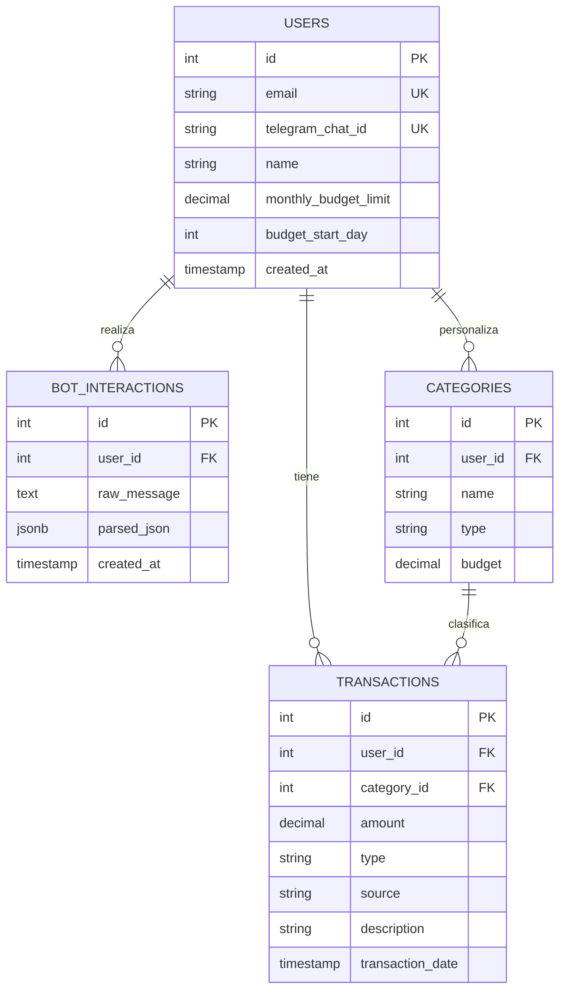

<!--
Sync Impact Report:
- Version change: 1.0.0 -> 1.1.0
- Modified principles: None (Code Quality, Testing Standards, User Experience Consistency, Performance Requirements preserved verbatim)
- Added sections: Product Context (Problem Statement, Objectives, User Personas), Technology Stack (Stack, Repository Structure, Data Base Schema)
- Removed sections: None
- Follow-up TODOs: None
-->

# MisiOps Constitution

## Core Principles

### I. Code Quality

All code MUST be clear, maintainable, and adhere to established style guidelines. Complexity MUST be justified. Refactoring is expected as part of the normal development lifecycle to prevent technical debt accumulation. This ensures that the codebase remains accessible and modifiable by all team members over time.

### II. Testing Standards (NON-NEGOTIABLE)

All new features and bug fixes MUST be accompanied by appropriate automated tests (unit, integration, or end-to-end). A Test-Driven Development (TDD) approach SHOULD be utilized where feasible. Changes MUST NOT be merged if they decrease overall test coverage or if any tests fail. Robust testing is critical for preventing regressions and maintaining high confidence in releases.

### III. User Experience Consistency

The application MUST provide a cohesive and predictable user experience. UI components, terminology, and interaction patterns MUST remain consistent across all screens and flows. Any deviation from established patterns MUST be explicitly justified and approved. This minimizes cognitive load on users and establishes brand trust.

### IV. Performance Requirements

Features MUST be designed and implemented with performance in mind. Latency MUST be minimized, and resource usage MUST be optimized. Any new functionality that degrades performance benchmarks MUST be rejected or immediately remediated. Fast and responsive applications are essential for user satisfaction and operational efficiency.

## Product Context

### Problem Statement

People often fail to track their personal finances, leading them into debt or leaving them with little to no money by the end of the month, because they lack traceability of where their money actually goes.

### Objectives

Deliver MisiOps: an end-to-end platform (frontend, backend, and a simple database) that helps people register their incomes and expenses via a natural-language-processing chatbot, and track their money throughout the month via a dashboard.

Roadmap (not yet in scope for the current build, documented here for architectural awareness):

- Scrape the user's personal Gmail inbox to detect bank/digital-wallet transaction notifications (e.g., Peru's Yape and Plin) and register them automatically.
- Train MLOps models on user transaction history to predict end-of-month savings.

### User Personas

**Iare** — a young man with a full-time job and medium earnings, but heavy debt obligations and consumerist habits, leaving him with close to zero savings most months. He wants a way to track his expenses but doesn't have time to log them at the end of each day — he needs low-friction, fast logging (hence the NLP chatbot interface over manual data entry forms).

## Technology Stack

### Stack

- **Frontend**: Next.js, TypeScript, Tailwind CSS, package manager: npm
- **Backend**: Python, FastAPI, package manager: uv
- **Database**: PostgreSQL

### Repository Structure

Monorepo layout (see `AGENTS.md` for the authoritative version):

```text
MisiOps/
├── .agents/          # AI agent configuration and skills
├── .specify/         # SDD lifecycle artifacts (constitution, templates, scripts)
├── backend/          # FastAPI application
│   ├── core/         # Global config, env vars, DB setup
│   ├── models/       # SQLAlchemy models
│   ├── main.py       # FastAPI entrypoint
│   └── pyproject.toml # Backend dependencies (managed with uv)
├── diagrams/          # Architecture diagrams (e.g. Excalidraw, ERDs)
├── frontend/          # Next.js client application
├── specs/             # Feature specifications (spec-kit output)
├── AGENTS.md          # Agent rules and guidelines
└── mcp-config.json    # MCP server configuration
```

### Data Base Schema

Source: `diagrams/database-schema.png`.



## Additional Constraints

Technology stack choices and architectural decisions MUST prioritize security and maintainability. Third-party dependencies MUST be kept up-to-date and audited regularly for known vulnerabilities. Deployments MUST NOT occur without passing automated security scans.

## Development Workflow

Development MUST occur on feature branches and be integrated via Pull Requests (PRs). Every PR MUST receive at least one peer review that specifically checks for adherence to these constitutional principles. Code MUST NOT be merged until all automated Continuous Integration (CI) quality gates (tests, linting, security scans) have passed successfully.

## Governance

This Constitution supersedes all other engineering practices and guidelines.
Amendments to this document require a formal proposal, review by technical leadership, and an explicit transition plan for any breaking changes to workflow or standards.
Versioning of this constitution follows Semantic Versioning (MAJOR for significant shifts or rule removals, MINOR for additions, PATCH for clarifications).
All PRs and code reviews MUST actively verify compliance with these rules.

**Version**: 1.1.0 | **Ratified**: 2026-09-09 | **Last Amended**: 2026-09-11
