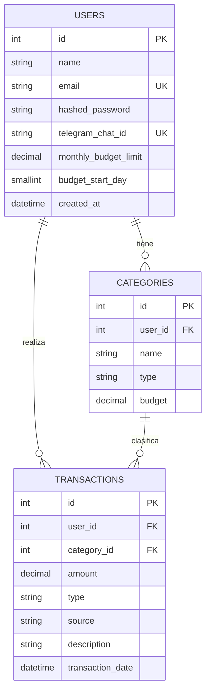

# Modelo Entidad-Relación de MisiOps

A continuación se muestra el modelo Entidad-Relación de la base de datos de MisiOps, generado a partir de los modelos de SQLAlchemy.

```mermaid
erDiagram
    USERS {
        int id PK
        string name
        string email UK
        string hashed_password
        string telegram_chat_id UK
        decimal monthly_budget_limit
        smallint budget_start_day
        datetime created_at
    }

    CATEGORIES {
        int id PK
        int user_id FK
        string name
        string type
        decimal budget
    }

    TRANSACTIONS {
        int id PK
        int user_id FK
        int category_id FK
        decimal amount
        string type
        string source
        string description
        datetime transaction_date
    }

    USERS ||--o{ CATEGORIES : "tiene"
    USERS ||--o{ TRANSACTIONS : "realiza"
    CATEGORIES ||--o{ TRANSACTIONS : "clasifica"
```
