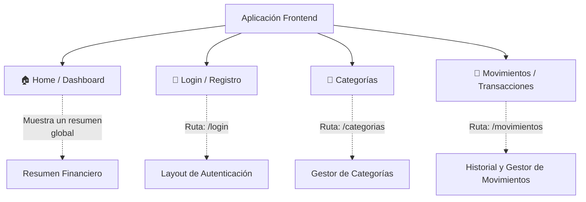

# Páginas del Frontend (Next.js)

Estructura principal de las páginas e interfaces de usuario del frontend de MisiOps.

## Mapa de Rutas

## Directorio de Rutas
- `/`: **Dashboard Principal**. Muestra el resumen del estado financiero y balance.
- `/login`: **Página de Autenticación**. Donde los usuarios inician sesión y se registran.
- `/categorias`: **Administración de Categorías**. Interfaz para crear, editar y eliminar categorías de ingresos y gastos.
- `/movimientos`: **Historial de Transacciones**. Tabla e interfaz para registrar, filtrar y gestionar los ingresos y gastos (transacciones).
